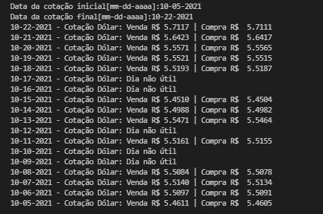

**Cotação_dólar - API (Python)**


Este projeto tem como objetivo realizar a cotação do dólar referente a uma data ou um período.

A cotação é realizada através da solicitação dos inputs da data inicial (mm-dd-aaaa) e data final  (mm-dd-aaaa), estas informações serão a base para alimentar a API que retornará com os valores das cotações do dólar correspondentes a venda e a compra.

As informações serão fornecidas apenas para dias úteis, aos finais de semana aparecerá a informação: `dia não útil`.

Foram rodados testes para: data futura, data no final de semana, feriado e dias úteis.


**ESTRUTURA DO REPOSITÓRIO**
```
├── cotacao.py
├── docs
│   └── imagem_cotacao.JPG
├── main.py
├── readme.md
└── tests
    └── test_cotacao.py
```
#
**DEMONSTRAÇÃO DA APLICAÇÃO**



#
**EXPLICAÇÃO DOS ARQUIVOS**

* docs: <p>- armazenamento da imagem `.jpg` com a demonstração da aplicação.</p>
<br/>

* main.py:<br/>
    <p>- consta os inputs das datas para a realização da cotação, como também, a conversão dessas datas para o padrão solicitado pelo site responsável pela API.</p>  
    <p>O retorno da API será estruturado em um dicionário.
    A função print_cotacao realiza a configuração da visualização das informações disponíveis no dicionário.</p> 
    <p> O arquivo main.py é responsável por rodar o código. </p>
